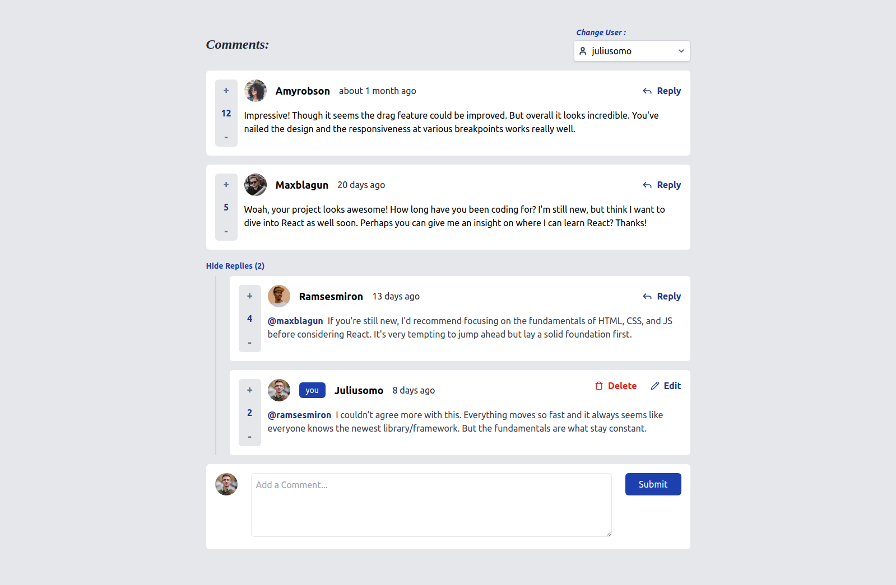
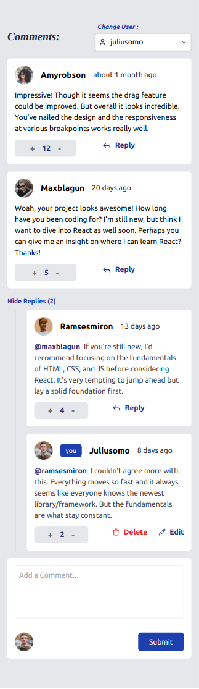

# Frontend Mentor - REST Countries API with color theme switcher solution

This is a solution to the [Interactive comments section challenge on Frontend Mentor](https://www.frontendmentor.io/challenges/interactive-comments-section-iG1RugEG9).

## Table of contents

-   [Overview](#overview)
    -   [Features](#Features)
    -   [Screenshot](#screenshot)
    -   [Links](#links)
-   [My process](#my-process)
    -   [Built with](#built-with)
-   [Author](#author)

## Overview

### Features

Users: Easily switch between users to post comments and replies.
Dynamic Commenting: Add, edit, and delete comments with real-time updates.
Nested Replies: Seamlessly view and respond to comments with nested replies.
Voting System: Up-vote and down-vote comments to express your opinion.
Responsive Design: Fully functional on both desktop and mobile devices.
Image Avatars: Customizable user avatars displayed with each comment.
Error Handling: User-friendly "Page Not Found" (404) UI for better navigation.

### Screenshot

### Links

-   Live Site URL: [live site URL](https://frontend-mentor-comment-section.vercel.app/)

### Built with

-   ReactJS
-   TypeScript
-   React-router-dom
-   TailwindCss
-   lucide-react

## Author

-   Github - [Ahmed Lebda](https://github.com/AhmedLebda)
-   Frontend Mentor - [Ahmed Lebda](https://www.frontendmentor.io/profile/AhmedLebda)
